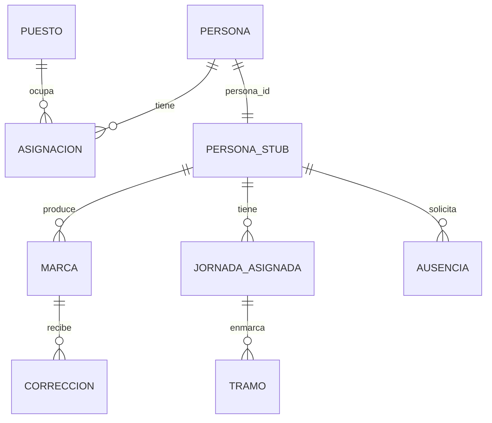

# Modelo conceptual del sistema completo

**Sistema de Control de Jornada**
Folio SCJ-MOD-01 · Versión 1.0 · 22 de agosto de 2026

Diagrama entidad-relación del sistema completo, incluyendo las entidades del subsistema de Personas
como cajas con sus atributos. **Trabajo conjunto.** Corresponde al entregable E1 de `SCJ-ESP-01`.

---

## I. Alcance del diagrama

Este es el único documento donde aparecen **las entidades de los dos subsistemas**. Sirve para ver
el sistema entero de una vez y para identificar exactamente dónde está la frontera.

Del subsistema de Personas se muestran las entidades y sus atributos, **sin implementación ni
datos**. No es el modelo de ese subsistema: es su silueta.

---

## II. Diagrama

> Fuente en `diagramas/fuente/conceptual.mmd` · Imagen en `diagramas/export/conceptual.svg`

*Sustituir por el diagrama acordado en la sesión.*

---

## III. Entidades del subsistema de Personas

| Entidad | Qué representa | Atributos principales |
|---|---|---|
| | | |

---

## IV. Entidades del subsistema de Tiempo

| Entidad | Qué representa | Atributos principales |
|---|---|---|
| | | |

---

## V. La frontera en el diagrama

**Cuáles relaciones cruzan** y por qué ninguna otra lo hace. Ver `SCJ-FRO-01`.

---

## VI. Desacuerdos y preguntas abiertas

Lo que no quedó resuelto en la sesión. Se traslada a `SCJ-PRA-01`.

| # | Pregunta | Quién la levanta |
|---|---|---|
| | | |

---

*Modelo conceptual · Folio SCJ-MOD-01 · V1.0*
