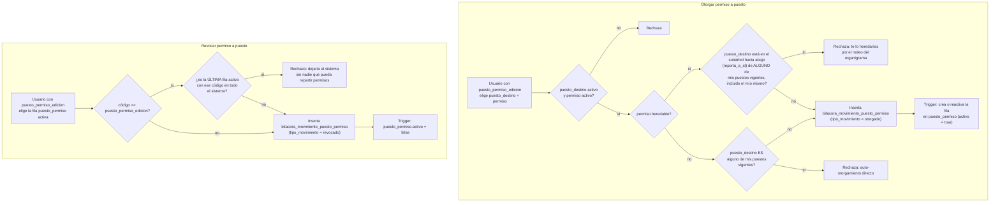

# Proceso — Otorgar/revocar permiso a puesto

**Sistema de Control de Jornada**
Folio SCJ-PRO-05 · Versión 2.0 · 4 de septiembre de 2026

Quinto documento de la serie `SCJ-PRO`, subsistema **Personas y Usuarios** — módulo
Asignaciones/áreas/puestos/permisos. Cubre el proceso más sensible del módulo: quién puede darle
un permiso a un puesto (`puesto_permiso`), y las dos protecciones que evitan que ese acto se use
para ampliar los propios permisos o para dejar al sistema sin nadie que pueda repartirlos.

> **Cambió en V2.0:** el §VII decía "nada de este proceso está construido" — eso ya no es cierto.
> El proceso se implementó de punta a punta el mismo día de la V1.0 (backend `routers/permisos.py`,
> `UNIQUE(puesto_id, codigo)` en DDL, frontend `OtorgarPermisoPage`/`RevocarPermisoPage`), y el
> documento nunca se actualizó después. `security` verificó línea por línea (4 de septiembre de
> 2026) que las 3 reglas de negocio de §V están implementadas exactamente como se describen acá,
> sin desviación. Contradice contenido ya escrito (mayor, no menor), de ahí el bump a V2.0.

---

## I. Alcance

**Cubre:** otorgar un permiso a un puesto, revocarlo, y las validaciones de seguridad de ambos
actos.

**No cubre:**

- **Alta de área/departamento/puesto** — `SCJ-PRO-03`.
- **Asignación de persona a puesto** — `SCJ-PRO-04`.
- **Alta del catálogo de `permiso`** — no es proceso de usuario (`SCJ-PRO-03 §I`), se siembra por
  migración al integrar un módulo nuevo.

---

## II. Precondiciones

1. Usuario autenticado con `puesto_permiso_edicion` en alguno de sus puestos vigentes (puede tener
   varios, `SCJ-PRO-04`).
2. El puesto destino existe y `Puesto_activo = true`.
3. El permiso destino existe y `activo = true`.

---

## III. Diagrama de flujo

---

## IV. Descripción paso a paso

| Paso | Actor | Acción | Toca |
|---|---|---|---|
| G0 | Usuario con `puesto_permiso_edicion` | Elige puesto destino y permiso | — |
| G1 | Sistema | Rechaza si el puesto o el permiso están inactivos | `personas.puesto`, `personas.permiso` |
| G3-G4 | Sistema | Si el permiso es `heredable`, recorre el subárbol hacia abajo (por `reporta_a_id`) de **cada** puesto vigente del solicitante; rechaza si el destino aparece ahí (incluido el propio puesto) | `personas.puesto` |
| G3-G6 | Sistema | Si el permiso **no** es `heredable`, sólo rechaza si el destino es exactamente uno de los puestos vigentes del solicitante | `personas.puesto` |
| G7 | Sistema | Registra el movimiento en `bitacora_movimiento_puesto_permiso` | `bitacora_movimiento_puesto_permiso` |
| G8 | Sistema (trigger) | Crea o reactiva la fila de `puesto_permiso` para ese `(puesto, código)` | `personas.puesto_permiso` |
| R0 | Usuario con `puesto_permiso_edicion` | Elige una fila `puesto_permiso` activa a revocar | `personas.puesto_permiso` |
| R1-R2 | Sistema | Si el código es `puesto_permiso_edicion`, cuenta cuántas filas activas quedan con ese código en todo el sistema; rechaza si esta sería la última | `personas.puesto_permiso` |
| R4 | Sistema | Registra el movimiento (`revocado`) | `bitacora_movimiento_puesto_permiso` |
| R5 | Sistema (trigger) | `puesto_permiso.activo = false` | `personas.puesto_permiso` |

---

## V. Reglas de negocio confirmadas

- **Bloqueo de auto-otorgamiento directo, siempre.** Nadie puede otorgarle un permiso — heredable
  o no — a un puesto que tiene asignado en este momento.
- **Bloqueo extendido al subárbol completo cuando el permiso es heredable.** Un permiso heredable
  sube por `reporta_a_id`; si se le otorga a un subordinado, también llega a quien está arriba en
  esa cadena. Sin este bloqueo, dárselo a un subordinado sería un rodeo de un paso para dártelo a
  ti mismo. Un permiso **no** heredable no tiene este riesgo — sólo se bloquea el puesto propio.
- **La restricción aplica a la unión de todos tus puestos vigentes**, no a uno solo — consistente
  con que una persona puede cubrir varios puestos a la vez (`SCJ-PRO-04`).
- **No se puede dejar el sistema sin nadie que pueda repartir permisos.** Revocar la última fila
  activa de `puesto_permiso_edicion` en todo el sistema se rechaza — un deadlock así sólo se
  arregla por acceso directo a la base, y con 8 personas es un riesgo real, no teórico.
- **Herencia sube por `reporta_a_id`, confirmado con `SCJ-DEC-05`.** El jefe puede lo que puede su
  subordinado si el permiso es heredable; no al revés.
- **`heredable` y `activo` de `permiso` son atributos del catálogo, no de la relación.** Ambos ya
  viven en `personas.permiso`; `puesto_permiso` sólo decide a quién se le otorgó.

---

## VI. Cambios que este proceso requiere en piezas ya cerradas

- **`puesto_permiso` necesita `UNIQUE(puesto_id, codigo)`.** El esquema actual no lo tiene — sin
  esa restricción, otorgar el mismo permiso dos veces al mismo puesto podría crear dos filas en
  vez de reactivar una, y el trigger de G8 no sabría cuál es "la" fila a tocar.
- **El trigger de G8/R5 es nuevo** — mismo patrón que `fn_bitacora_sincroniza_persona`
  (`SCJ-PRO-02`), pero para `bitacora_movimiento_puesto_permiso` → `puesto_permiso.activo`. No
  existe todavía.

---

## VII. Estado actual — implementado

Todo el proceso está construido, de punta a punta, desde el corte de `puesto_permiso` (4 de
septiembre de 2026, commits desde `d3997cb`):

- **DB:** `personas.puesto_permiso` y `personas.bitacora_movimiento_puesto_permiso`
  (`22_personas_puesto_permiso.sql`, `23_personas_bitacora_puesto_permiso.sql`), con
  `UNIQUE(puesto_id, codigo)` (`uq_puesto_permiso_puesto_codigo`, resolviendo el punto §VI) y el
  trigger de sincronización G8/R5 (`24_puesto_permiso_trigger.sql`).
- **Backend:** `backend/app/routers/permisos.py` — `POST /api/permisos/otorgar` y
  `POST /api/permisos/revocar` implementan G0-G8 y R0-R5 exactamente como se describen en §III/§IV,
  incluidas las tres reglas de §V (bloqueo directo, bloqueo por herencia sobre la unión de todos
  los puestos vigentes, protección de última fila de `puesto_permiso_edicion`).
- **Frontend:** `OtorgarPermisoPage`, `RevocarPermisoPage`, `PermisosPage`.
- **RLS:** las escrituras de `puesto_permiso`/`bitacora_movimiento_puesto_permiso` exigen
  `puesto_permiso_edicion` real (`31_personas_rls_permiso_especifico.sql`, 4 de septiembre de
  2026), no sólo estar activo.

Verificado línea por línea contra este documento por `security` el 4 de septiembre de 2026, sin
desviaciones.

**Arranque del sistema — quién otorga el primer `puesto_permiso_edicion`.** La precondición §II.1
exige que quien otorga ya tenga el permiso; al nacer el sistema nadie lo tiene todavía — mismo
problema de origen que `SCJ-PRO-01` (el primer RH tampoco puede darse de alta a sí mismo). Se
resuelve igual: **el puesto Sistemas (TI) nace sembrado por migración** con
`puesto_permiso_edicion` ya activo, sin pasar por este proceso.

Sistemas reporta directo a Dirección — Dirección **no** está en el subárbol hacia abajo de
Sistemas (está arriba, por `reporta_a_id`), así que Sistemas otorgándoselo a Dirección **no** viola
el bloqueo de auto-otorgamiento por herencia (§III, `G3-G4`): ese bloqueo es sobre el subárbol
propio hacia abajo, no hacia arriba. Dirección no necesita sembrarse con el permiso — lo recibe de
Sistemas por el proceso normal, una vez sembrado Sistemas.

---

## VIII. Siguiente paso

Con `SCJ-PRO-03`, `SCJ-PRO-04`, `SCJ-PRO-05` y `SCJ-PRO-06` cerrados e implementados, el módulo
Asignaciones/áreas/puestos/permisos tiene sus cuatro procesos principales cubiertos, tanto en
diseño como en código. Queda pendiente:

- Decidir con el usuario si falta algún otro proceso del módulo antes de compilar el plan de
  implementación (`SCJ-MOD` + `SCJ-DEC` + estos `SCJ-PRO`) y actualizar el Sprint Backlog de Notion
  (ver `[[notion-sprint-backlog-scj]]`).

---

*Proceso · Folio SCJ-PRO-05 · V2.0*
