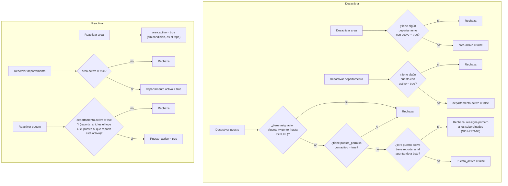

# Proceso — Baja/desactivación de estructura organizacional (área / departamento / puesto)

**Sistema de Control de Jornada**
Folio SCJ-PRO-06 · Versión 1.0 · 4 de septiembre de 2026

Sexto documento de la serie `SCJ-PRO`, subsistema **Personas y Usuarios** — módulo
Asignaciones/áreas/puestos/permisos. Cierra el módulo: cubre desactivar (`activo = false`) y
reactivar (`activo = true`) área, departamento y puesto, precisando la regla ya anunciada en
`SCJ-PRO-03 §V` ("no se desactiva si tiene información asociada activa río abajo").

---

## I. Alcance

**Cubre:** desactivación y reactivación de `area`, `departamento`, `puesto`.

**No cubre:**

- **Alta** de estos tres catálogos — `SCJ-PRO-03`.
- **Asignación de persona a puesto** — `SCJ-PRO-04`.
- **Otorgar/revocar permiso a puesto** — `SCJ-PRO-05`.
- **Desactivación de `permiso`** — no es proceso de usuario. Igual que su alta (`SCJ-PRO-03 §I`),
  se toca por migración al momento de deprecar un módulo, no desde una UI.
- **Ningún `DELETE`.** Este proceso, como el resto del módulo, nunca borra filas — sólo cambia
  `activo`.

---

## II. Precondiciones

1. Usuario con el permiso de edición correspondiente (`area_edicion`, `departamento_edicion` o
   `puesto_edicion`).
2. La entidad existe. Para desactivar, `activo = true`; para reactivar, `activo = false`.

---

## III. Diagrama de flujo

---

## IV. Descripción paso a paso

| Paso | Actor | Acción | Toca |
|---|---|---|---|
| DA1 | Sistema | Rechaza desactivar `area` si algún `departamento` hijo sigue `activo = true` | `personas.departamento` |
| DD1 | Sistema | Rechaza desactivar `departamento` si algún `puesto` hijo sigue `Puesto_activo = true` | `personas.puesto` |
| DP1 | Sistema | Rechaza desactivar `puesto` si tiene una `asignacion` vigente (persona ocupándolo) | `personas.asignacion` |
| DP3 | Sistema | Rechaza si tiene algún `puesto_permiso.activo = true` (permisos otorgados) | `personas.puesto_permiso` |
| DP4 | Sistema | Rechaza si algún puesto activo le reporta (`reporta_a_id` apunta a éste) | `personas.puesto` |
| RA1 | Sistema | `area` se reactiva sin condición — es el tope de la jerarquía | `personas.area` |
| RD1 | Sistema | `departamento` sólo se reactiva si su `area` está activa | `personas.area` |
| RP1 | Sistema | `puesto` sólo se reactiva si su `departamento` está activo **y** el puesto al que reporta está activo (o es el puesto tope) | `personas.departamento`, `personas.puesto` |

---

## V. Reglas de negocio confirmadas

- **"Información asociada activa río abajo" (`SCJ-PRO-03 §V`) significa hijos DIRECTOS, no toda la
  cadena transitiva.** `area` sólo revisa `departamento`; `departamento` sólo revisa `puesto`. La
  protección de tres niveles se logra sola: no puedes desactivar `area` mientras tenga un
  `departamento` activo, y no puedes desactivar ese `departamento` mientras tenga un `puesto`
  activo — así que `area` nunca queda desactivada con un `puesto` vivo debajo, sin que `area` tenga
  que revisar `puesto` directamente.
- **`puesto` es el único con tres fuentes de bloqueo distintas**, porque es el único nivel con tres
  tipos de "hijo": personas asignadas (`asignacion`), permisos otorgados (`puesto_permiso`), y
  puestos subordinados (`reporta_a_id` de otros apuntando a éste). Los otros dos catálogos sólo
  tienen un tipo de hijo cada uno.
- **Reactivar depende de la cadena hacia arriba, no hacia abajo.** Un `puesto` no puede reactivarse
  colgado de un `departamento` inactivo, ni un `departamento` de un `area` inactiva. `puesto`
  también valida su propio `reporta_a_id`: no puede reactivarse reportando a un puesto que sigue
  inactivo.
- **Nunca hay `DELETE`.** Consistente con el resto del proyecto (`asignacion`, `puesto_permiso`) —
  desactivar es la única forma de "retirar" algo del catálogo, preservando el historial completo.
- **`permiso` queda fuera de este proceso a propósito** — su ciclo de vida es de migración/deploy,
  no de operación diaria (`SCJ-PRO-03 §I`).

---

## VI. Estado actual — sin implementar

Nada de este proceso está construido. Depende de que `SCJ-PRO-03`, `04` y `05` se implementen
primero (usa las mismas tablas: `area`, `departamento`, `puesto`, `asignacion`, `puesto_permiso`).

---

## VII. Siguiente paso

Con `SCJ-PRO-03` a `06` cerrados, el módulo **Asignaciones/áreas/puestos/permisos** tiene su
diseño de procesos completo — alta, asignación, permisos y baja de los tres catálogos. Sigue:
actualizar el Sprint Backlog de Notion (`[[notion-sprint-backlog-scj]]`) reflejando este avance, y
de ahí compilar el plan de implementación (`SCJ-MOD` + `SCJ-DEC` + estos `SCJ-PRO-03/04/05/06`)
para pasarlo a ejecución.

---

*Proceso · Folio SCJ-PRO-06 · V1.0*
